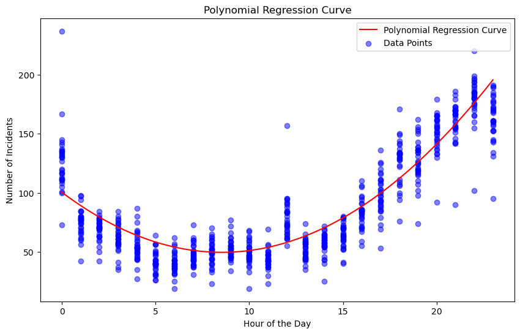

## Team Project 2 - Group 26

# Auto Theft in Toronto Data Analysis

**Project Participants**

- Hui Li
- Mamdouh Zaydan 
- Ryan Tsui 
- Tristan Liu
- Valeria Guimaraes

#### Data Selection: 
https://data.torontopolice.on.ca/datasets/TorontoPS::auto-theft-open-data/

#### Analysis
[Data_Analysis_and_Visualization](./src/auto_theft_analysis_team26%20.ipynb)

#### Objective

This project aims to provide initial observations that may guide Toronto Police Services in allocating resources to manage auto theft in Toronto. The focus areas include geographic prioritization, temporal resource allocation, trends over time, and a review for potential data biases

**Introduction**

In our second team project, we merged participants from two different teams to collaborate on a data analysis task under a tight deadline. During the initial meeting, four team members gathered to discuss the best approach for the project, considering the limited time available.

The discussion centered around two main options: either building on previous projects or analyzing a new dataset. After a preliminary analysis of potential new datasets, the team decided to focus on the Auto Theft data from the Toronto Police Services' open data portal. This decision was based on the relevance of the data and its potential to yield valuable insights within the project's timeframe.

Each team member selected a specific task to work on:
- Broad data cleaning and ensuring reproducibility of the report.
- Determining when (time/days) resources should be allocated.
- Examining auto theft trends over the years to assess whether funding for Auto Theft initiatives should be adjusted.
- Investigating potential biases and errors in the dataset and producing a related writeup.
- Analyzing where resources should be prioritized geographically.

#####  Introdutory Data Analysis
Team Member: Valeria Guimaraes
[Initial_Data_Analysis](./src/initial_data_analysis.ipynb)

- Data Import
The dataset used in this analysis was sourced from the Toronto Police Services open data portal. The initial step involved importing the data into a pandas DataFrame for exploration and cleaning.

- Initial Data Exploration
Upon loading the data, an initial exploration was conducted to understand the structure of the dataset and identify any missing values.

- Column Names: 
The dataset contained various columns, some of which were not relevant to our analysis.

- Missing Values: 
Missing values were identified and rows containing them were removed to ensure the integrity of the dataset.

- Column Selection and Cleaning
Certain columns in the dataset were found to be ambiguous or irrelevant to the analysis. 

- Final Dataset
After cleaning, the dataset was reduced to the most relevant columns, which provided a streamlined and focused dataset for subsequent analysis.

####  Answer When (time/ days) should resources be allocated
Team Member: Hui Li
[Regression_Analysis](./src/test_regression.ipynb)

**Project Overview**

This project focuses on analyzing auto theft incidents in Toronto to help the Toronto Police Services allocate resources more effectively. The goal was to identify the times of day when auto thefts are most likely to occur using historical data.

- Data Analysis: 
I worked on cleaning and grouping the data by the hour of the day to prepare it for analysis.

- Polynomial Regression: 
I implemented polynomial regression to model the relationship between the hour of the day and the number of incidents.

- Teamwork and Assistance
This project was a team effort. I took the lead on the regression analysis. My team and I worked together to ensure the analysis was accurate and insightful.

- Role of ChatGPT
ChatGPT assisted me by:
- Helping select and implement the best regression model.
- Resolving coding issues during the project.
The guidance provided by ChatGPT helped streamline the process and improve the quality of the final analysis.

**Conclusion** 
The analysis provides actionable insights into when auto thefts are most likely to occur, helping the Toronto Police Services allocate their resources more effectively during peak hours.

**Summary:**
My Work: Simplified to focus on key tasks like data analysis, regression, and visualization.

Visualization: Highlighted with a brief explanation of its significance.

Teamwork and ChatGPT: Mentioned to show collaboration and the value of the assistance received.

####  Auto theft trend over time
Team Member: Ryan Tsui
[Incidents_by_Premises](./src/auto_theft_trends_over_time.ipynb)

Objective: Investigate whether the data suggests there is a growing trend in reported incidences over the years within the TPS dataset.

***Teamwork and Assistance***

We had a team effort in analyzing & reviewing the dataset to identify an objective that would be presentable for this analysis and potentially actionable by the audience, whether that may be the TPS, civil servants in Toronto & Ontario, or even any Toronto resident interested in the topic of Toronto Auto Theft.

The cleaning of the dataset was spearheaded by Valeria and she also helped with the visualization on the split by premises type through the use of One Hot Encoding.

***Conclusion***

We see a consistent growth in auto theft since 2017 over the years which has spiked since 2022. While the years 2022 and 2023 may become outliers the overall trend points to, without intervention, the environment has shifted to likely expect increased reported auto theft occurances since 2021. 
We also see that no single premises type is driving the increase in auto thefts, they are generally up across the board even though House Reports have become the larger portion of requests over the years in the TPS dataset.

#### Investigate and generate writeup on the dataset to investigate biases potential errors.
Team Member: Mamdouh Zaydan
[Excel_dataset](./data/processed/Auto_Theft_Open_Data_Investigation_Mzaydan.xlsx)

**Objective**
The objective of this analysis is to guide the Toronto Police Services on how best to allocate resources to manage auto theft in the Toronto region. This involves examining the dataset for biases, potential errors, and patterns that can inform resource allocation strategies.

- Data Cleaning and Preparation.
More precisely, I investigated and generated writeup on the dataset to investigate biases potential errors.

- Handling Old Data
Deleted Rows: Rows where OCC_DATE is 2000 and 2001 were removed from the dataset. These dates were considered too old and likely less relevant for current analysis. Additionally, specific rows (1994, 3081, 17362, 56052) were deleted due to the same reason. These rows were identified as potentially erroneous or outdated data.

- Handling Missing Geographic Data
Rows with Zero Coordinates: A total of 717 rows contained zeros in both LONG_WGS84 and LAT_WGS84 columns. These values are geographically nonsensical for Toronto. Given the high number of such rows, they have been retained in the dataset but flagged as containing missing or potentially erroneous geographic data. They have not been deleted to preserve the dataset's completeness. It is noted that these rows show "NSA" (Not Specified/ Available) in other columns, which reinforces their questionable reliability.

Data Analysis
1. Temporal Analysis

o Day of the Week (REPORT_DOW):
A pivot table was created with REPORT_DOW in Rows and EVENT_UNIQUE_ID in Values. The analysis revealed that the number of reports is significantly lower on Sundays compared to other days of the week. This suggests that auto theft incidents might be less reported or
occur less frequently on Sundays.

o Time of Day (REPORT_HOUR): [^1]
Another pivot table was created with REPORT_HOUR in Rows and EVENT_UNIQUE_ID in Values. The analysis indicated that the number of reports peaks in the early morning hours, specifically at 6, 7, and 8 AM.
This pattern could suggest that auto theft incidents are more frequently reported or occur during these early morning hours.

2. Geographic Analysis

o Neighborhood Analysis (NEIGHBOURHOOD_158):
A pivot table was created to examine the number of thefts across different neighborhoods. It was observed that the neighborhood of West Humber- Clairville has a disproportionately high number of reports compared to other neighborhoods. This indicates a higher incidence of auto theft in this area, which may require increased resources or targeted intervention.

***Conclusion and Recommendations***

Data Integrity: The dataset has been cleaned to remove outdated data and to flag rows with missing geographic information. These rows have not been deleted to avoid loss of valuable data but should be considered carefully in any further analysis.

Resource Allocation: Based on the analysis:
o Temporal Resource Allocation: Consider focusing resources on early morning hours (6-8 AM) and reviewing reporting patterns on Sundays.
o Geographic Resource Allocation: Allocate additional resources to the West Humber-Clairville neighborhood due to its high number of reported auto theft incidents.

[^1]: Discrepancy in Findings: During our analysis, it was observed that one of the team members used a different variable for their investigation, and used the REPORT variables as the other team members based their analysises on the OCC, Number of Occurences. This has resulted in some variation in the findings compared to the other analyses. While this offers an interesting perspective, we advise interpreting these results with caution and in the context of the overall findings presented in this exercise.

